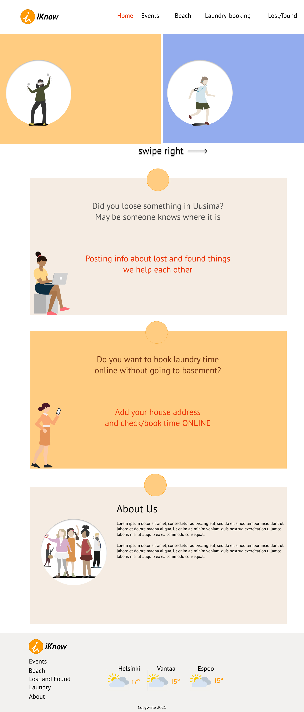

# This is a full stack team project of Business College Helsinki students.

## Name: Iknow

## Design



### Figma design: is [here](https://www.figma.com/file/N7nNNqAgPQIwLQiqGKfoUB/Summer-team-project?node-id=15%3A0)

### Live page is [here](https://iknow-tau.vercel.app/)

### Backend page is [here](https://iknow-backend.herokuapp.com/)

#

## Idea: make life easier for uusima area citizens to know about:

- offline/online events
- weather conditions and lakes/sea temperature level to be able to choose what beach you would like to visit in summer time
- lost and found items in Uusima
- check available laundry time and book new one

#

## Technologies used

### Built with:

- React
- JavaScript
- Node express js
- React Bootstrap
- HTML
- CSS

#

### it is open source. Clone it and

```js
npm install
npm install react-router-dom
npm install axios
npm install json-server --save-dev
npm install react-bootstrap bootstrap@4.6.0
npm install react-bootstrap-4-pagination
npm install react-paginate --save
```

#

### Authors and acknowledgment:

### Julia Matvi: [GitHub](https://github.com/jualiasha), [LinkedIn](www.linkedin.com/in/jualiasha)

### Diana Korotkevica: [GitHub](https://github.com/dariwka), [LinkedIn](www.linkedin.com/in/diana-korotkevica-70b62a207)

### all team members please add your contact details here
